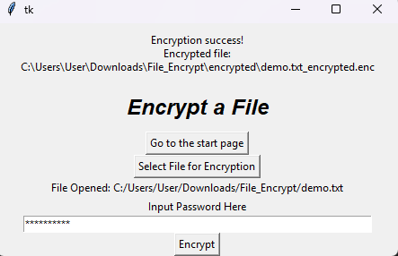
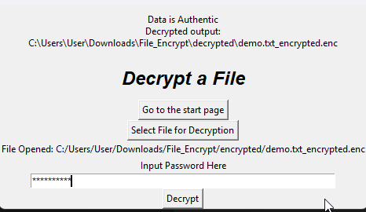

# File Encrypt/Decrypt Tool (scrypt + AES-GCM, Tkinter GUI)

A small educational **file encryption/decryption tool** written in Python.

It uses:

- **scrypt** as a password-based key derivation function (KDF)
- **AES-GCM** as the authenticated encryption mode (providing confidentiality + integrity)
- A simple **CSV file** (`authenticate.csv`) to track salts, nonces, ciphertext paths and tags
- A **Tkinter GUI** to make it easy for non-technical users to encrypt and decrypt files

> **Note:** This project is for learning and demonstration purposes only.  
> It is **not** audited or hardened for production use.

---

## Features

- **Password-based file encryption**

  - User chooses any file and a password
  - Password is turned into a key using **scrypt** with per-file random salt
  - File contents are encrypted using **AES-GCM** (authenticated encryption)

- **Per-file salt & KDF parameters stored, not the password**

  - The app stores:
    - KDF parameters (`KDF`, `N`, `r`, `p`)
    - Random `salt`
    - `nonce` (IV), `tag`
    - Path to the encrypted file
    - Original file path
  - No plaintext password is stored anywhere

- **Simple CSV “database”**

  - Metadata is tracked in `authenticate.csv` with this structure:

    1. `kdf` – KDF algorithm name (e.g. `scrypt`)
    2. `n` – scrypt N parameter
    3. `r` – scrypt r parameter
    4. `p` – scrypt p parameter
    5. `salt` – base64-encoded random salt
    6. `aead` – AEAD algorithm (e.g. `AES-GCM`)
    7. `nonce` – base64-encoded nonce
    8. `ciphertext_enc` – path to the encrypted file
    9. `tag` – base64-encoded authentication tag
    10. `filename` – original file path

- **Tkinter GUI**

  - Start page with options to **Encrypt** or **Decrypt**
  - File picker dialog for selecting input files
  - Password entry fields (masked)
  - Status messages and popup dialogs for success/failure

- **Cleanup**

  - On successful decryption:
    - The decrypted file is written to the `decrypted/` directory

---

## Project Structure

Approximate layout:

```text
.
├── main.py          # Entry point: sets up CSV & launches Tkinter App
├── gui.py           # Tkinter UI (StartPage, Encrypt Page, Decrypt Page)
├── utils.py         # Core encrypt() / decrypt() functions and constants
├── authenticate.csv # CSV "database" created on first run
├── encrypted/       # Encrypted files (created automatically)
├── decrypted/       # Decrypted files (created automatically)
└── README.md        # This file
```

---

## How It Works (High-Level)

### 1. Encryption Flow

1. User selects a file in the **Encrypt** page and enters a password.

2. The app:

   - Generates a 16-byte random **salt** with `get_random_bytes()`.

   - Uses **scrypt** to derive a 16-byte key from the password + salt:

     ```python
     key = scrypt(password, salt, 16, N=N, r=r, p=p)
     ```

   - Creates an AES-GCM cipher:

     ```python
     cipher = AES.new(key, AES.MODE_GCM)
     ```

   - Encrypts the file contents and obtains `ciphertext` + `tag`.

   - Base64-encodes `salt`, `nonce`, `ciphertext`, and `tag` and writes the ciphertext to an `.enc` file in `encrypted/`.

   - Appends a new row to `authenticate.csv` with:

     - KDF parameters
     - Encoded salt
     - Encoded nonce
     - Ciphertext path
     - Encoded tag
     - Original file path

3. The GUI shows a **success message** and the path of the encrypted file.

### 2. Decryption Flow

1. User selects an `.enc` file in the **Decrypt** page and enters a password.

2. The app:

   - Looks for a matching row in `authenticate.csv` based on the encrypted file path or file name.
   - Reads KDF parameters, salt, nonce, tag, and ciphertext path from that row.
   - Re-derives the key using **scrypt** with the stored parameters and salt.
   - Decrypts the ciphertext with AES-GCM.
   - Verifies the tag (`cipher.verify(tag)`):

     - If it fails, raises an error: incorrect key or tampered data.
     - If it succeeds, writes the plaintext to the `decrypted/` directory.

3. The GUI shows a **success message** and the path of the decrypted file.

---

## Requirements

- Python **3.8+** (recommended)
- Tkinter (usually included with standard Python on Windows/macOS; may need a package on some Linux systems)
- [PyCryptodome](https://pycryptodome.readthedocs.io/en/latest/) (or compatible `Crypto` library)

---

## Usage

### Run the GUI

From the project root:

`python main.py`

You should see the Tkinter window with:

- A **start page** (“File Encrypt/Decrypt Tool by Purinat33”)
- Buttons to **Encrypt File** or **Decrypt File**

---

### Encrypting a File

1. Click **“Encrypt File”** on the start page.
2. Click **“Select File for Encryption”** and choose the file you want to encrypt.
3. Enter your password in the password field.
4. Click **“Encrypt”**.
5. On success, you’ll see:

   - A popup message box
   - The path to the encrypted file in the status label

6. The encrypted file will be written to the `encrypted/` directory, and metadata will be stored in `authenticate.csv`.

---

### Decrypting a File

1. Click **“Decrypt File”** on the start page.
2. Click **“Select File for Decryption”** and choose the `.enc` file from the `encrypted/` directory.
3. Enter the same password you used for encryption.
4. Click **“Decrypt”**.
5. If the key is correct and data is intact:

   - You’ll see a success message (“Data is Authentic”).
   - The decrypted output path will be shown.

6. The decrypted file will be written to the `decrypted/` directory.

If the password is wrong or the ciphertext/tag has been tampered with, the app will show an **error** dialog.

---

## Security Notes & Limitations

- This project is intended for **learning** and **portfolio** purposes.

- It uses good building blocks (scrypt + AES-GCM) but does **not**:

  - Enforce password strength
  - Manage secure deletion of plaintext or ciphertext on disk
  - Protect against side-channel, memory, or filesystem attacks
  - Provide any key escrow or backup feature

- Do **not** rely on this as a complete production solution for high-value or sensitive data.

---

## Possible Future Improvements

- Add **password strength indicator** in the GUI.
- Allow **re-encryption** with a new password.
- Add an option to **keep** or automatically **delete** ciphertext after successful decryption.
- Support **multiple KDF/AEAD algorithms** and let the user choose in advanced settings.
- Package as a standalone executable (e.g. using `pyinstaller`) for non-technical users.

---

## License and Credits

- This project uses a Tkinter multi-page GUI pattern originally shared by Bryan Oakley on Stack Overflow (Switch between two frames in Tkinter), retrieved under **CC BY-SA 4.0** and adapted for this tool.
- Crypto primitives are provided by the PyCryptodome library.

---

## Photos




